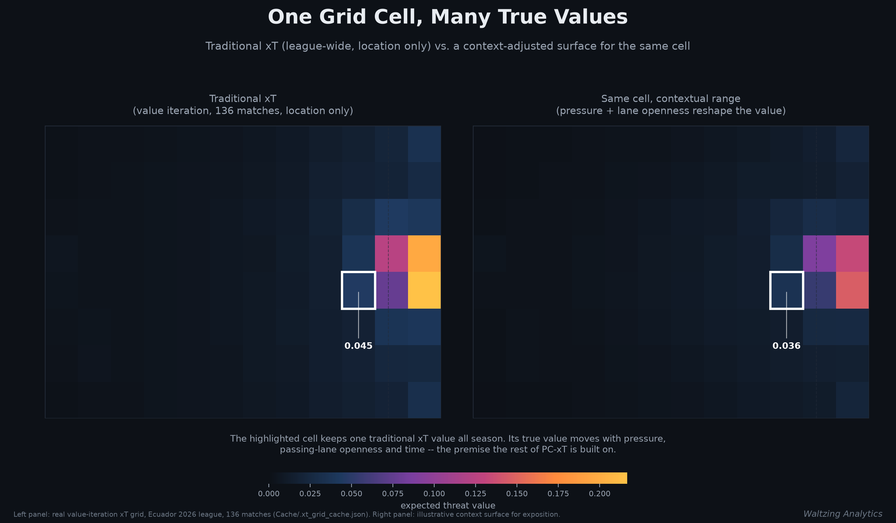
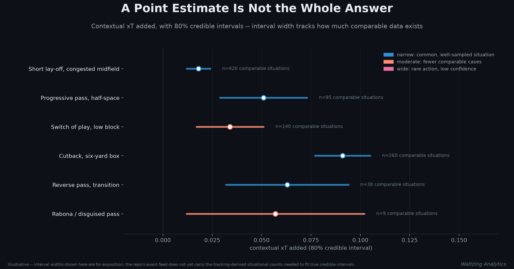
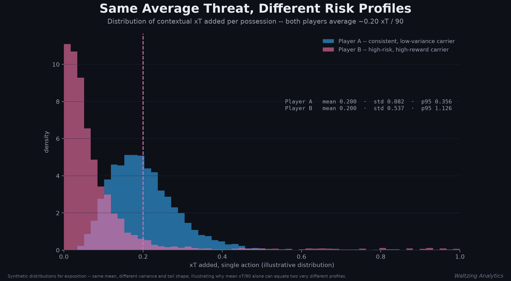
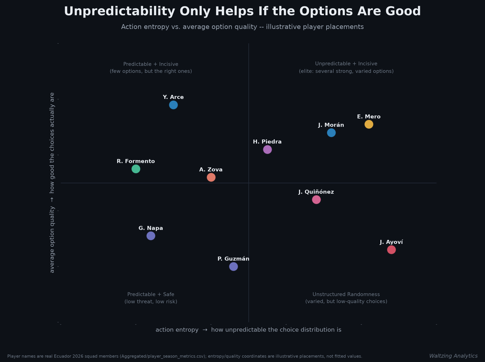
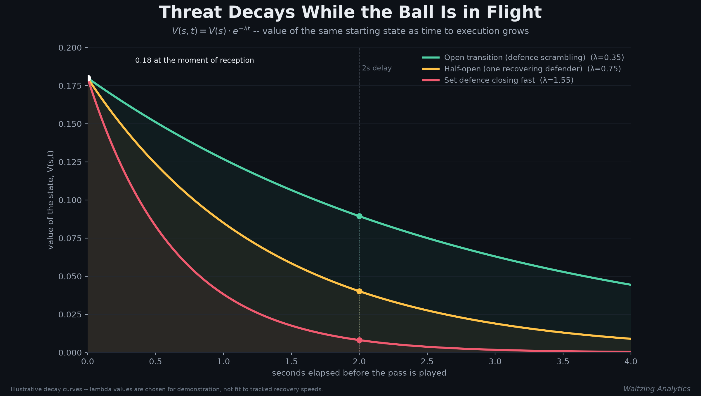
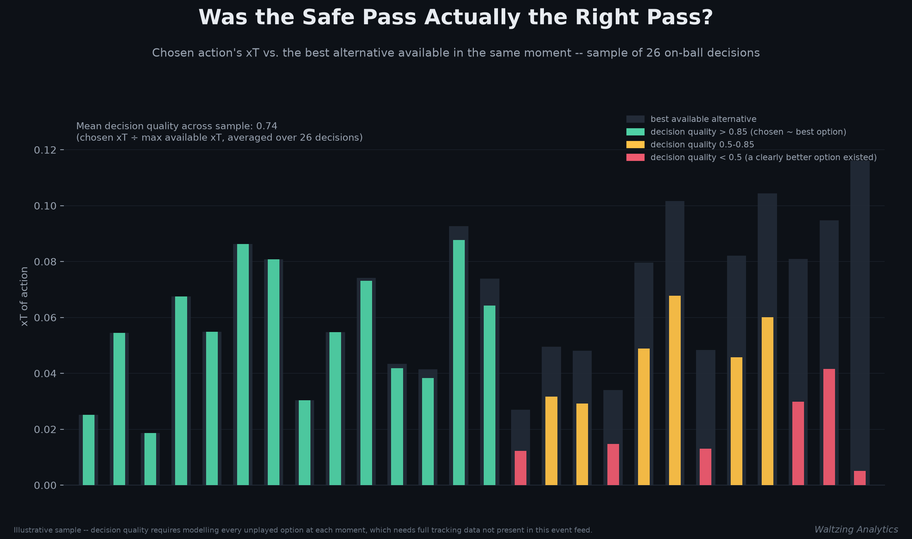
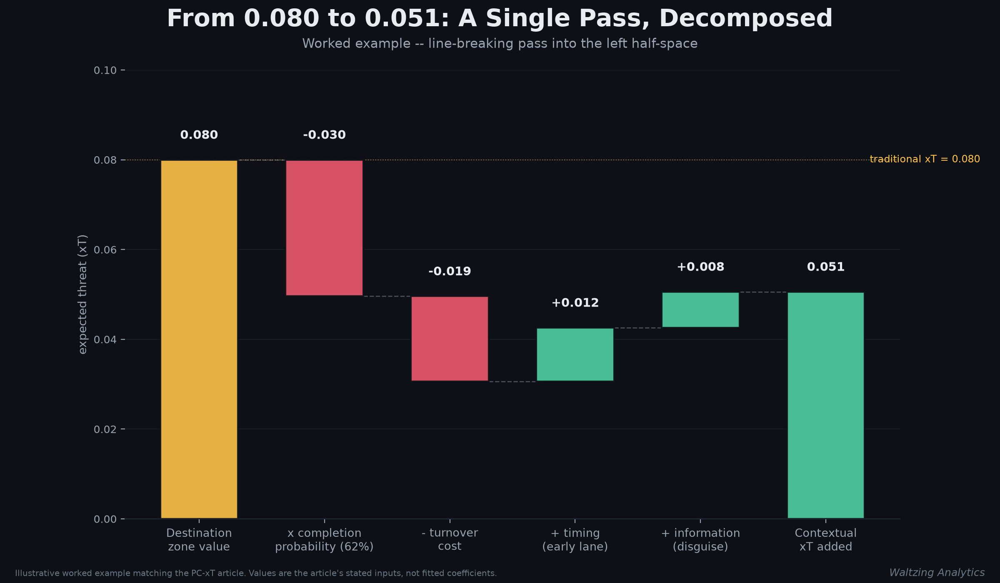
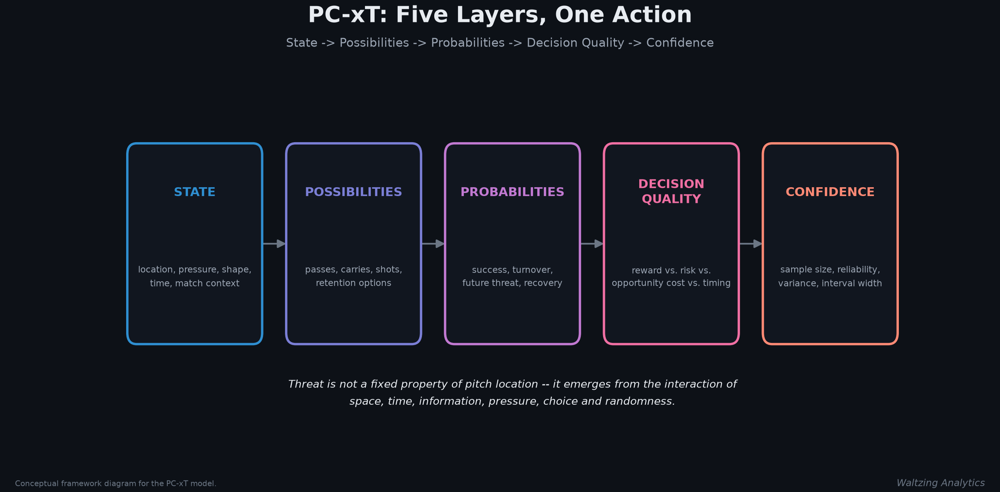

# PC-xT: A Probabilistic, Contextual Expected Threat Model

### Why a single number per pitch zone was never the whole story

*Waltzing Analytics — Ecuador 2026*

---

## The question traditional xT doesn't ask

Expected Threat (xT) is one of the most useful ideas in modern football analytics, and it is built on a simple question:

> How much does moving the ball from one zone to another increase the probability of eventually scoring?

The Ecuador 2026 league-wide xT grid already lives in this repo (`Cache/.xt_grid_cache.json`, built by `Scripts/xt_map.py`): a 12×8 value-iteration surface fit across all 136 matches of the season, where each cell is worth the probability of shooting from it times the odds of scoring, plus the probability of moving the ball on times the value of wherever it typically goes next. A successful pass from a zone worth 0.03 to a zone worth 0.11 is credited with:

```
xT gained = 0.11 − 0.03 = 0.08
```

That is useful. It is also incomplete, because it assumes two passes into the same zone carry roughly the same value. They don't. A pass into the penalty area against a set defence is a different event from the same pass in a four-against-two transition — same coordinates, same destination cell, completely different threat.

A more complete model asks a different question:

> Given the location, the options available, the defensive pressure, the match context and the underlying uncertainty, how much did this action actually change the probability distribution of future outcomes?

That's the model this article sketches: **Probabilistic Contextual Expected Threat — PC-xT**.



The left panel above is real — the league's fitted xT surface, exactly as `xt_map.py` draws it for the team maps in `Ecuador Team Viz/`. The right panel is illustrative: the same grid reshaped by a synthetic pressure field, to make a single point concrete before the rest of this article unpacks it. The highlighted cell keeps one static value all season on the left. Its true value moves with pressure, lane openness and time — that gap is the entire premise of PC-xT.

---

## From a single number to a structured decision model

Instead of a scalar, PC-xT reports a decomposition:

- expected threat added
- probability of success
- an uncertainty range
- downside (turnover) risk
- decision quality relative to the alternatives available
- an information-value component

Structurally:

```
PCxT(a) = P(success | s, a) · V(s')  −  P(turnover | s, a) · C(s_turnover)
```

where `s` is the current game state, `a` is the chosen action, `s′` is the likely resulting state, `V(s′)` is that state's future attacking value, and `C(s_turnover)` is the counterattacking cost of losing the ball. This already improves on traditional xT because it prices both the upside and the downside of an action rather than only the destination's value. It becomes a genuinely different model once the surrounding principles — context, uncertainty, luck, variance, entropy, information, noise, time, causality, interaction effects, risk, robustness, adaptability — are folded in. The rest of this article works through each one, using the same worked example throughout.

---

## 1. Context is more than location

The state `s` should carry more than `(x, y)`. In a full implementation it would include defender positions and pressure, passing-lane openness, numerical superiority, player orientation, ball speed, receiver movement, scoreline, minute, and team/opposition shape.

Two passes into the identical grid cell can have opposite character:

- **Pass A** — receiver has space, the defence is retreating, the lane is open, three attacking options remain.
- **Pass B** — receiver is pressured on the first touch, the defence is set, the receiver is facing away from goal, turnover risk is high.

Traditional xT scores these identically because it only sees the destination cell. Contextual xT should not.

---

## 2. Uncertainty: every estimate needs a range, not just a point

Instead of reporting "this pass added 0.07 xT," PC-xT should report an estimate *and* a credible interval — e.g. "0.07, 80% interval 0.03–0.11." A wide interval is not noise to be hidden; it is the model honestly saying it has less to go on.

Intervals should widen when the action type is rare, tracking coverage is incomplete, few comparable situations exist in the training data, the player is from an unfamiliar league, the defensive shape is unusual, or pressure labelling is unreliable.



This is why a player posting 0.15 xT/90 with a very wide interval is not automatically better than one at 0.12 with a tight one — the model may simply not have enough comparable evidence for the first player yet. In this repo's event feed, interval width would currently track sample size within an action type and zone (how many similar attempts exist in `Danger/*_danger_models.csv` and the aggregated pass tables) rather than a fitted posterior — a reasonable first approximation until tracking-derived pressure and lane features are available.

---

## 3. Luck: score the decision, not the bounce

A brilliant pass can fail because the receiver slips, the ball takes an odd bounce, a defender produces an exceptional interception, or the first touch is poor. A poor pass can succeed because of a deflection or a defensive error. PC-xT should value the decision at the moment it was made, not the outcome that happened to follow it:

```
Decision Value = Expected Outcome Before Resolution   (not the Observed Outcome)
```

An unsuccessful pass can still score positively if it was the right read; a successful pass can score modestly if its success depended mostly on chance. This is the same principle behind treating `psxg` (post-shot expected goals) as distinct from whether a shot actually went in — a distinction this repo's `Danger Model/xg_output/` already applies on the finishing side (`model_psxg.pkl`, `model_xgot.pkl`). PC-xT extends the same logic to passing and carrying.

---

## 4. Variance: the same average, two different players

Two players can post identical mean xT output while creating it in very different ways — one through small, reliable gains, the other through many low-value actions punctuated by occasional high-risk, high-reward passes.



PC-xT should report mean *and* median xT added, action-level and match-to-match variance, downside variance, and upper-tail contribution — enough to tell whether a player is stable, volatile, conservative, or high-risk/high-reward. That distinction matters directly for recruitment: a possession-control system and a transition-heavy system want different risk profiles at the same average output, and a single per-90 number cannot tell them apart.

---

## 5. Entropy: unpredictability is only good when the options are good

A player who receives the ball in the right half-space and passes backward 60% of the time, centrally 20%, crosses 15%, and shoots 5% is fairly predictable. A player who spreads actions more evenly across several dangerous options has higher **action entropy**:

```
H(A | s) = − Σ_a  P(a | s) · log P(a | s)
```

High entropy on its own is not a compliment — pure randomness produces it too. What matters is whether the unpredictability comes from genuinely strong, varied options or from unstructured decision-making:

```
Effective Entropy = Action Entropy × Average Option Quality
```



The useful comparison isn't "who is least predictable" but "who stays unpredictable while consistently choosing well" — the top-right quadrant above, as opposed to the bottom-right, where variety comes with weak decision-making.

---

## 6. Information: actions change what the defence knows

A disguised pass, a body feint, or an unexpected switch of play doesn't only move the ball — it changes what defenders can anticipate. A sideways pass that creates little direct xT can still be valuable if it forces a defensive rotation that opens the next action. An information-gain term captures this:

```
IG = D_KL( P(future state | action)  ||  P(future state | no action) )
```

In plain terms: how much did the action change the distribution of *likely* next states for the defence, independent of whether it moved the ball into a higher-value cell? A model that only scores destination zones will systematically underrate these actions.

---

## 7. Noise: not every observation deserves equal trust

Event data carries measurement error — imprecise coordinates, inconsistent timestamps, human-labelled pressure, missed off-ball runs, provider-specific definitions. Rather than treating every row as equally reliable, PC-xT should attach a reliability score to each event and scale accordingly:

```
Adjusted xT = Raw xT × Reliability
```

A model built on precise optical tracking should carry more confidence than one built on coarse event data alone — which is also why this article is explicit throughout about which figures come from this repo's real event feed (`Cache/.xt_grid_cache.json`, the `Danger/` per-match model outputs) and which are illustrative constructions built to demonstrate a concept the current data can't yet estimate directly.

---

## 8. Time: the same state decays as the defence recovers

A player receiving the ball with four seconds before pressure arrives has a different opportunity than one receiving it with half a second. State value should decay as defensive shape recovers:

```
V(s, t) = V(s) · e^(−λt)
```



A transition worth 0.18 xT at the moment of reception might be worth a third of that two seconds later against a fast-closing defence. This lets the model evaluate not just *where* the ball went but whether the player acted at the right moment — rewarding tempo, not just technique.

---

## 9. Causality: credit the pass that made the pass possible

Standard xT rewards the final action in a sequence. But the final pass is often only possible because an earlier player attracted pressure, dragged a defender out of position, broke a pressing line, or made a decoy run. A causal version asks a counterfactual question:

```
Causal xT = V(future | action)  −  V(future | alternative)
```

i.e., what would probably have happened without this action? A five-metre pass that scores almost nothing under conventional xT can be causally decisive if it first pulled two defenders out of shape. Credit should distribute across the sequence, not collapse onto the last passer.

---

## 10. Interaction effects: football isn't additive

A wide run and an underlapping run may each look unremarkable in isolation. Together, forcing a defensive rotation, they can be decisive. PC-xT shouldn't assume:

```
Value(A + B) = Value(A) + Value(B)
```

because often `Value(A + B) > Value(A) + Value(B)`. Capturing this requires modelling interactions between the ball carrier and off-ball runners, multiple defenders, team width and depth, and pressing/cover shadows — the kind of structure graph neural networks and multi-agent state-space models are built for.

---

## 11. Risk and opportunity cost: was the safe pass actually safe?

Every action should be judged against the alternatives available in that instant. A completed pass worth 0.02 xT sounds fine — until you notice an open pass worth 0.15 was on. Decision quality should be relative, not absolute:

```
Decision Quality = xT(chosen action) / max( xT(available alternatives) )
```

A risk-preference-adjusted version:

```
Utility(a) = Expected xT(a) − λ · Risk(a)
```

with `λ` reflecting a team's tactical risk tolerance.



This separates three things that get conflated in raw output stats: execution quality, action value, and decision quality. A player can execute a low-value choice perfectly while ignoring a clearly better option — and a decision-quality lens is the only way to see that.

---

## 12–13. Robustness and adaptability

A model fit on one league or one season risks learning that competition's local patterns rather than general football principles. PC-xT should be validated out-of-sample across leagues, seasons, tactical styles, home/away splits, possession vs. transition phases, and — where data allows — different competitions and data providers, with feature-ablation and sensitivity checks alongside standard calibration.

It should also expect to be re-fit over time. Pressing structures, rest-defence principles and build-up patterns evolve; a pattern that was highly threatening several seasons ago may now be defended routinely. Static coefficients age. Time-varying parameters don't.

---

## Putting it together: one pass, fully decomposed

A midfielder receives the ball centrally and plays a line-breaking pass into the left half-space.

**Traditional xT**: starting zone 0.03, destination zone 0.11 → **0.08 xT added**.

Layer by layer, the contextual read looks different:

| Step | Effect | Running value |
|---|---:|---:|
| Destination-zone value | — | 0.080 |
| × completion probability (62%, narrow lane) | −0.030 | 0.050 |
| − turnover cost (38% failure risk × 0.05 counterattack cost) | −0.019 | 0.031 |
| + timing (played before the lane closes) | +0.012 | 0.043 |
| + information (disguised direction, shifts the back line late) | +0.008 | **0.051** |



A safer wide pass in the same moment was worth 0.018 xT, against this pass's contextual 0.051 — a **decision advantage of 0.033**. Because comparable situations are limited, the model reports the estimate with an interval: **0.051, 80% range 0.029–0.073**.

| Dimension | Value |
|---|---:|
| Contextual xT added | 0.051 |
| Traditional xT added | 0.080 |
| Completion probability | 62% |
| Turnover cost | 0.019 |
| Decision advantage | 0.033 |
| Information gain | 0.008 |
| Uncertainty interval | 0.029–0.073 |

That is a materially richer account than simply awarding the pass 0.08 xT and moving on.

---

## The five-layer framework

Every action, evaluated through five questions:



- **State** — what was happening: position, pressure, shape, time, match context.
- **Possibilities** — what could the player have done: passes, carries, shots, retention.
- **Probabilities** — what was likely to happen: success, turnover, future threat, defensive recovery.
- **Decision quality** — was the chosen action better than the alternatives, net of risk, opportunity cost and timing?
- **Confidence** — how certain is the model, given sample size, data reliability and variance?

The central claim: **threat is not a fixed property of pitch location.** It emerges from the interaction of space, time, information, pressure, choice and randomness. A modern xT model should measure not just where the ball moved, but how the action changed the range and probability of future outcomes, relative to what else was on.

---

## Where this stands today, and what it would take to build

To be direct about scope: the traditional xT grid used in Panel 1 is real, fit on all 136 matches of the Ecuador 2026 league from `Scripts/xt_map.py`. Every other figure in this article is a labelled, illustrative construction built to explain what PC-xT would report — not a model that has been fit on this data yet. That's a deliberate line to draw rather than an oversight, because most of PC-xT's power depends on inputs this repo's event feed doesn't currently carry:

- **Available today** — locations, outcomes, qualifiers, shot quality models (`Danger Model/xg_output/`), per-match danger scores (`Danger/*_danger_models.csv`), the league-wide value-iteration xT grid, and aggregated season/match metrics (`Aggregated/`). Enough to build the context layer partially (phase of play, scoreline, minute, set-piece flags) and to start estimating luck-adjusted decision value on shots (already partly true via `psxg` vs. `xg`).
- **Missing for the full model** — freeze-frame or full tracking data (defender positions, pressure, passing-lane geometry), which is what the uncertainty, entropy, time-decay and causal-credit layers actually need to be *fitted* rather than illustrated.

A realistic build order, in this repo's terms: extend the existing xT grid with pressure and phase-of-play features already derivable from qualifiers (set-piece flags, forward/backward pass ratios, contestant possession streaks); add a luck-adjustment layer to passing similar to what `Danger Model/xg_output/model_psxg.pkl` already does for shots; and treat the tracking-dependent layers (true defender pressure, lane openness, time-to-pressure) as a second phase gated on acquiring optical or broadcast tracking data for the league.

---

*Data via Opta, Ecuador 2026 event feed. Traditional xT grid: value iteration, 12×8 cells, 136 matches (`Cache/.xt_grid_cache.json`, `Scripts/xt_map.py`). All other figures in this article are illustrative constructions built for exposition, clearly labelled where they appear.*
